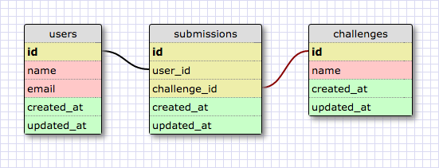

# Part 4: SQL Queries

## Summary
In this part of the assessment you will be working with the provided `challenge_submissions.db` database to demonstrate your ability to work with data in a relational database.  The schema is made up of three tables: `users`, `submissions`, and `challenges` (see Figure 1).

  
*Figure 1*.  Database schema visualization.

To get started open a SQLITE session in the console with the following command (note: assuming in the part-4 directory)

```bash
$ sqlite3 challenge_submissions.db
```


## Releases
### Release 0: Query the Database
For each question below, write a single SQL query that will answer the question. The query should return only the data that is requested.

Copy each query and its output to the `part-4/queries.md` file.

1. What are all the challenge names?
2. Which challenge names include the word "javascript"?
3. What are the ids of the challenges submitted by Jane Miller?
4. What are the names of the challenges submitted by Jackie McNeil? (Each name should be listed once; no repeats.)
5. What are the names of the users who submitted the challenge named "sinatra-vs-rails"? (Each name should be listed once; no repeats.)
6. What is the name of the challenge with the most submissions, and how many submissions does it have?


### Release 1: Modify the Database
In each item below, you'll be asked to update the database in some way. You may run multiple statements to make an update. Record any SQL statements that you write to make the updates in the `part-4/queries.md` file.

1. The "javascript-closures" challenge, one of the challenges in the database, was submitted by Skylar Lawson.  Update the database to reflect this.
2. The "api-only-rails" challenge was renamed to "build-an-api-in-rails".  Update the database to reflect this.
3. The "learning-angular" challenge was removed.  Remove this challenge and its submissions from the database.


## Conclusion

You are done with Part 4. If you have not committed your changes, please do so before moving onto Part 5.
