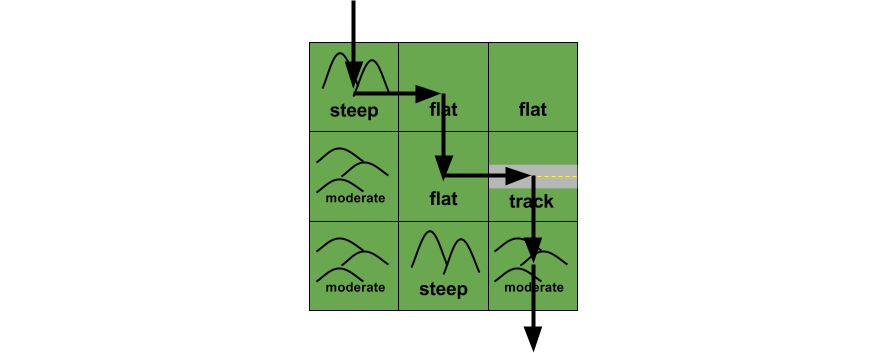

# Part 2: Work with a collection

## Summary

In this part of the assessment, we are going to be working with a collection of objects. We've been provided two classes and the specs that describe the behaviors of the classes.

### What are we building?

We'll be building a `CityMap` class to represent the neighborhoods of Rectangle City. Rectangle City has a lot of bike commuters who are frustrated because it is hard to estimate how long it will take to bike anywhere. Some neighborhoods have lots of steep hills that are slow to bike. Others are flat which is fast to bike. They have hired you to write a program to help calculate how long their trips should take.

The four types of terrain you'll see in the city are represented in our data by four letters:

| letter | terrain  | description |
| :----- | :------- | :---------- |
| S      | Steep    | Steep, rolling hills; this takes the most time to travel through. |
| M      | Moderate | Moderate hills, still takes longer but not as bad. |
| F      | Flat     | Streets with no hills to worry about, but traffic and lights will slow things down a bit. |
| T      | Track    | A bike racing track. You can ride as fast as you want. |

To simplify things, we'll divide the city up into square sections. Here's a 3x3 map of different sections:

```text
Steep     Flat   Flat
Moderate  Flat   Track
Moderate  Steep  Moderate
```

In your head you could visualize the city like this:


### Classes
#### `TerrainHelper`
The `TerrainHelper` class has been written for us. It will help us build our city map with some nice helper utilities, check it out.

Tests have been provided that describe what this class does. Take some time to examine the code and the specs side-by-side since we'll be using `TerrainHelper` later.


#### `CityMap`
The `CityMap` class is somewhat complete. We can initialize an instance of `CityMap` with:

 * `terrain_list`, a flat list of terrain letters (ex. ["S", "M", "F"])
 * `size`, the map size
 * `terrain_helper`, a terrain helper

## Releases

## Release 0: `CityMap#terrain_map`

Look at the tests. When our `CityMap` is initialized it receives a flat list of terrain letters. For example: `["S","F","F","M","F","T","M","S","M"]`.

`CityMap#terrain_map` will need to take those letters, convert them to terrain symbols, and lay them out on a 2D map with the dimensions `size` x `size` (the dimensions of the map might change based on how large a part of the city we're mapping distances for).

That means `["S","F","F","M","F","T","M","S","M"]` with size 3 will become:

```ruby
[
  [:steep,    :flat,  :flat    ],
  [:moderate, :flat,  :track   ],
  [:moderate, :steep, :moderate]
]
```

**Don't forget to read the existing code and specs before diving in.**

A group of tests is provided to describe how an instance of `CityMap` behaves
when told to make a 2D map of terrain.  This group of tests is [tagged][]
`terrain_map`.  To run the tests specific to the `#terrain_map` method, from
the root directory run:

```
rspec --tag terrain_map
```

The tests in the example group should be failing.  Update the `CityMap` class in `city_map.rb` to make the tests pass.

*Do not modify the tests.*

## Release 1: `CityMap#time_estimate_for_trip`

In this release we need to write a method that takes a path across the city and estimates about how long it will take. The time estimate will be the sum of the time estimates for each of the squares that is traversed.

As input, the method will take in a list of coordinates made up of `row` and `column` like so: `[[row, column], [row, column], [row, column]]`.

So if our method receives this list...
```ruby
[[0,0], [0,1], [1,1], [1,2], [2,2]]
```

... then it will need to return an estimate of how long this path will take to travel by bike:



A group of tests is provided to describe how an instance of `CityMap` behaves
when told to estimate trip time.  This group of tests is tagged
`time_estimate`.  To run the tests specific to the `time_estimate_for_trip` method, from the
root directory run:

```
rspec --tag time_estimate
```

The tests in the example group should be failing.  Update the `CityMap` class in `city_map.rb` to make the tests pass.

*Do not modify the tests.*


## Conclusion
Once all the specs have passed (`rspec spec`), you have completed Part 2 of the assessment. If you haven't done so already, commit your changes and move on to Part 3.

[tagged]: https://www.relishapp.com/rspec/rspec-core/v/2-4/docs/command-line/tag-option
